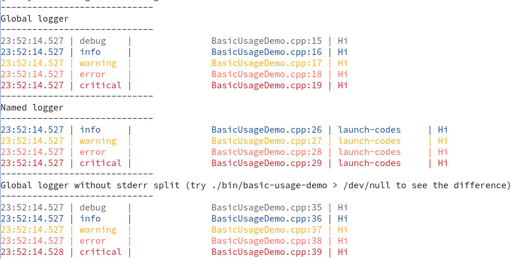

# Minilog

Minilog is a tiny logger library meant to be convenient to use and small, while still being reasonably fast.

It certainly won't be highly performant, at least not in early versions due to reliance on `std::cout`, but console IO is fundamentally slow anyway.

This library was created because the previous log library I use fell to AI slop. It was initially implemented as a part of stc, and then broadened to allow for some additional features and fixes.

This logger is considered mostly feature-complete, aside a plan to maybe add a file logger at some point (because it's convenient for logging in games), and possibly adding some minor config options. It's a fucking logger, it doesn't need to be tens of thousands of lines of code.

## Features

* Colour when printing to stdout/stderr
* Formatting via `std::format`
* Configurable log levels to get more or less yapping
* `std::source_location` in the output
* Support for named loggers that are separately configured. These are left in for rare edge-cases that need multiple loggers, since supporting it isn't that hard
* Extremely few configurable options

### Planned for an unscheduled time

* File loggers

## Requirements

* C++23

## Example

This has been copied from `demos/src/BasicUsageDemo.cpp`:
```cpp
#include "minilog/logger/ConsoleLogger.hpp"
#include <iostream>
#include <minilog/minilog.hpp>

static void printHeader(const std::string& header) {
    std::cerr << "-----------------------------" << std::endl;
    std::cerr << header << std::endl;
    std::cerr << "-----------------------------" << std::endl;
}

int main() {
    minilog::setLevel(minilog::Level::Debug);

    printHeader("Global logger");
    minilog::debug("Hi");
    minilog::info("Hi");
    minilog::warn("Hi");
    minilog::error("Hi");
    minilog::critical("Hi");

    printHeader("Named logger");
    // Named loggers are primarily recommended for big applications that need more control over which loggers to enable,
    // though you need to try really hard for this to scale well.
    minilog::ConsoleLogger logger("launch-codes");
    logger.debug("Hi");
    logger.info("Hi");
    logger.warn("Hi");
    logger.error("Hi");
    logger.critical("Hi");

    printHeader("Global logger without stderr split (try ./bin/basic-usage-demo > /dev/null to see the difference)");
    // By default, minilog's ConsoleLogger sends error and critical to stderr instead of stdout. If you don't want that
    // for some reason, you can disable it:
    minilog::setErrorsAsStderr(false);
    minilog::debug("Hi");
    minilog::info("Hi");
    minilog::warn("Hi");
    minilog::error("Hi");
    minilog::critical("Hi");
}
```


